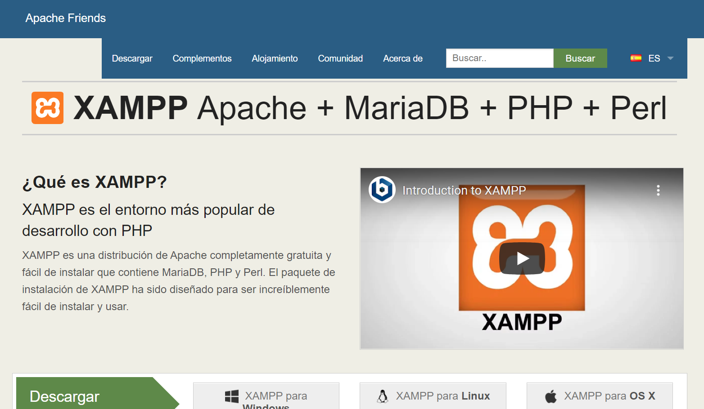
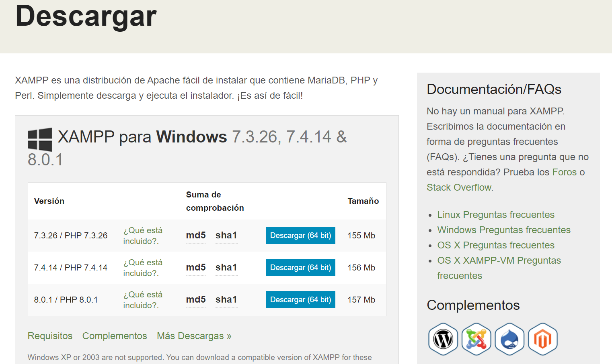
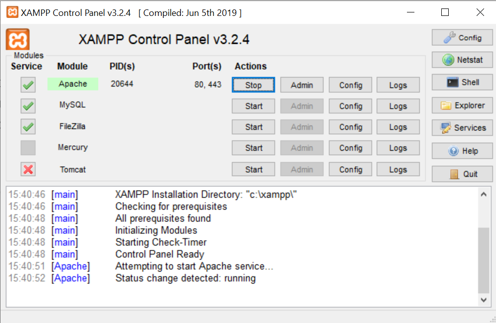

`#php` `#oop` `#master-in-software-engineering`

# Assembler School: OOP Basics with PHP <!-- omit in toc -->

In this project you will learn the basics of OOP using mobile devices as a reference. In the _"Project files"_ section you will find a description of the content to be displayed in each file.

## Table of contents

- [Table of contents](#table-of-contents)
- [Getting Started](#getting-started)
- [Dependencies](#dependencies)
- [Tools](#tools)
- [OOP Introduction](#oop-introduction)
- [Project files](#project-files)
- [OOP questions](#oop-questions)
  - [* What is object-oriented programming in general terms?](#-what-is-object-oriented-programming-in-general-terms)
  - [* What is a class?](#-what-is-a-class)
  - [* What is an object?](#-what-is-an-object)
  - [* What is an instance?](#-what-is-an-instance)
  - [* What is a property?](#-what-is-a-property)
  - [* What is a method?](#-what-is-a-method)
  - [* What is the difference between a function and a method?](#-what-is-the-difference-between-a-function-and-a-method)
  - [* What is a constructor?](#-what-is-a-constructor)
  - [* What is the difference between a class, an object and an instance?](#-what-is-the-difference-between-a-class-an-object-and-an-instance)
  - [* What do we understand about the concept of encapsulation?](#-what-do-we-understand-about-the-concept-of-encapsulation)
  - [* What do we understand about the concept of abstraction?](#-what-do-we-understand-about-the-concept-of-abstraction)
  - [* What do we understand about the concept of inheritance?](#-what-do-we-understand-about-the-concept-of-inheritance)
  - [* What do we understand about the concept of polymorphism?](#-what-do-we-understand-about-the-concept-of-polymorphism)
  - [* What do we understand about the concept of Overload?](#-what-do-we-understand-about-the-concept-of-overload)
  - [* What do we understand about the concept of Override?](#-what-do-we-understand-about-the-concept-of-override)
  - [* What differences exist between the concept of Overload and Override?](#-what-differences-exist-between-the-concept-of-overload-and-override)
  - [* What is a static class?](#-what-is-a-static-class)
  - [* Look for 3 advantages over object-oriented programming compared to other programming paradigms.](#-look-for-3-advantages-over-object-oriented-programming-compared-to-other-programming-paradigms)
  - [* Look for disadvantages of this paradigm.](#-look-for-disadvantages-of-this-paradigm)

## Getting Started

### The repo <!-- omit in toc -->

First, you will need to clone the repo:

```bash
$ git clone https://github.com/assembler-school/oop-basics.git
```

### Presentation material <!-- omit in toc -->

- [Slides](https://docs.google.com/presentation/d/1cZxutGPDqUGsLWLVen_ATjd7dEkeoPS_v_fy1y0C5Co/edit?usp=sharing)

## Dependencies

Before we can get started you will need to make sure that all the necessary dependencies are installed in your system.

### PHP <!-- omit in toc -->

You can install it by following the instructions [in the official docs](https://www.php.net/downloads) (we recommend that you install the version that is named _Current_).

To verify that you have installed it correctly, you can run the following command from the terminal that should output the version installed:

```bash
$ php -version
```

## Tools

In the event that you prefer to use a tool that installs everything you need to configure and run a PHP server, we recommend using [XAMPP](https://www.apachefriends.org/es/download.html)

### XAMPP <!-- omit in toc -->

XAMPP is a completely free and easy to install Apache distribution that contains MariaDB, PHP, and Perl. The XAMPP installation package has been designed to be incredibly easy to install and use.



You have to go to the [download page](https://www.apachefriends.org/es/download.html) and it will automatically recommend installing the latest version available.



Once downloaded and installed, in the case that the Windows operating system you will see the following screen, in which you will only have to start the Apache service.



## OOP Introduction

Object-oriented programming (OOP) is a programming paradigm based on the concept of "objects", which can contain data and code: data in the form of fields (often known as attributes or properties), and code, in the form of procedures (often known as methods).

## Project files

### [01 - Classes](./01-classes.php) <!-- omit in toc -->

The OOP paradigm encapsulates concepts of the real world in what is called as Classes which create Objects. In this file you will learn how to create a class and instanciate it.

### [02 - Properties](02-properties.php) <!-- omit in toc -->

Class member variables are called properties. In this file, you will learn how to add properties to a class and get them when the class is instantiated.

### [03 - Methods](03-methods.php) <!-- omit in toc -->

Properties define the characteristics of an object and the methods (functions in a class are called methods) which define the behavior of the Class. In this file you will learn how to create methods inside a class.

### [04 - Getters](04-getters.php) <!-- omit in toc -->

The get method returns the attribute value, usually there is a get method for each attribute of the class. In this file you will learn how to create **getter** methods.

### [05 - Setters](05-setters.php) <!-- omit in toc -->

The set method sets the attribute value, usually there is a get method for each attribute of the class. In this file you will learn how to create **setter** methods.

### [06 - Constructors](06-constructors.php) <!-- omit in toc -->

A constructor allows you to initialize an object's properties upon creation of the object. In this file you will learn how to create the constructor method.

### [07 - Inheritance problem](07-inheritance-problem.php) <!-- omit in toc -->

There are several disadvantages of not applying inheritance in our code. In this file you will lean what's the problem if you don't apply any inheritance in your code.

### [08 - Inheritance soluction](08-inheritance-solution.php) <!-- omit in toc -->

The child class will inherit all the public and protected properties and methods from the parent class. In addition, it can have its own properties and methods. In this file you will learn how to apply the inheritance in your code.

### [09 - Public, private & protected](09-public-private-protected.php) <!-- omit in toc -->

Properties and methods can have access modifiers which control where they can be accessed. In this file you will learn le three access modifiers.

### [10 - Static](10-static.php) <!-- omit in toc -->

Static properties and methods can be called directly - without creating an instance of the class first. In this file you will learn how to use static properties and methods.

### [11 - Const](11-const.php) <!-- omit in toc -->

Constants cannot be changed once it is declared. Class constants can be useful if you need to define some constant data within a class. In this file you will learn how to create constants within a class.

### [12 - Abstract classes](12-abstract-classes.php) <!-- omit in toc -->

Abstract classes and methods are when the parent class has a named method, but need its child class(es) to fill out the tasks. In this file you will learn how to create and use abstract classes.

### [13 - Interfaces](13-interfaces.php) <!-- omit in toc -->

Interfaces allow you to specify what methods a class should implement.
Interfaces make it easy to use a variety of different classes in the same way. When one or more classes use the same interface, it is referred to as "polymorphism". In this file you will learn how to create and extend interfaces.

### [14 - Overriding](14-overriding.php) <!-- omit in toc -->

In function overriding, both parent and child classes should have same function name with and number of arguments. In this file you will learn how to implement overriding.

### [15 - Overloading](15-overloading.php) <!-- omit in toc -->

Function overloading contains same function name and that function preforms different task according to number of arguments. In this file you will learn how to implement overloading.

### [16 - Namespaces](16-namespaces.php) <!-- omit in toc -->

Namespaces are qualifiers that solve two different problems:

1. They allow for better organization by grouping classes that work together to perform a task
2. They allow the same name to be used for more than one class

In this file you will learn how to create and use namespaces.

## OOP questions

### * What is object-oriented programming in general terms?
La Programación orientada a objetos es una estructura o paradigma de programación que se basa en la creación de “objetos”, entidades con un estado específico, una identidad y un comportamiento o método.

### * What is a class?
Una clase es un elemento que establece la estructura general de un tipo de objeto y establece sus métodos y propiedades predeterminadas.

### * What is an object?
Como ya hemos dicho, un objeto es una entidad o elemento con propiedades, estados y métodos (funciones) propias. 

### * What is an instance?
Los objetos son instancias de las clases, es decir, una concreción de esa estructura general.

### * What is a property?
Son los valores que las clases y los objetos tienen, ya sean heredados u obtenidos al crear el objeto. En resumen, son las variables que contienen los objetos desde el inicio.

### * What is a method?
Los métodos son las funciones que los objetos heredan u obtienen al crearse, tal y como pasa con las propiedades.

### * What is the difference between a function and a method?
La única diferencia entre ambas es su naturaleza, ya que el método es una función asociada al objeto u clase desde el inicio.

### * What is a constructor?
El constructor es la función que permite crear un objeto a partir de una clase, estableciendo sus propiedades y métodos.

### * What is the difference between a class, an object and an instance?
El objeto como elemento general de programación es simplemente un conjunto de datos diferentes y sus funcionalidades.
Una clase es un elemento que establece la estructura, propiedades y funciones por defecto de los objetos que se podrán crear a partir de la misma.
La instancia es la concreción de una clase en un objeto.

### * What do we understand about the concept of encapsulation?
Es la característica de los objetos y de la OOP de recoger un conjunto de datos en un mismo nivel y, juntamente con la característica de ocultación, impide acceder a esos datos fuera del objeto.

### * What do we understand about the concept of abstraction?
Es la característica de los objetos y de la OOP que permite abstraer o “simplificar” funciones y comportamientos complejos en simples métodos. Es decir, permite crear funcionamientos complejos y ocultarlos al usuario.

### * What do we understand about the concept of inheritance?
Es la característica de los objetos y de la OOP que permite transmitir información (propiedades y métodos) y estructuras de un elemento a otro, generalmente entre clases o de clases a objetos.

### * What do we understand about the concept of polymorphism?
Es la característica de los objetos y de la OOP para cambiar y adaptar su forma según los elementos contextuales y los elementos que forman parte del mismo.
En otras palabras, se pueden adaptar los objetos para que tengan diferentes métodos y resultados aún viniendo de la misma clase.

### * What do we understand about the concept of Overload?
Es la capacidad de una clase u objeto de tener diferentes métodos con el mismo nombre que necesitan parámetros diferentes y, por lo tanto, responden a los mismos de formas distintas.

### * What do we understand about the concept of Override?
Es la capacidad de una clase u objeto de redefinir un método de la parent class.

### * What differences exist between the concept of Overload and Override?
Overload es la adaptación de un método a diferentes parámetros, por lo que los argumentos que le pasemos siempre deberán ser diferentes.
En cambio override obliga a mantener la misma estructura para el método modificado, siendo los parámetros a pasar siempre los mismos.

### * What is a static class?
Las clases estáticas son clases que no pueden ser instanciadas ni heredadas, pero si son accesibles (también sus propiedades y métodos) desde fuera de la misma.

### * Look for 3 advantages over object-oriented programming compared to other programming paradigms.
- Versatilidad en su uso y mantenimiento en programación gracias a su reusabilidad.
- Su capacidad de protección y privacidad gracias a sus propiedades de encapsulamiento, visibilidad y abstracción.
- Efectividad al poder usar y adaptar las clases para diferentes usos gracias a la herencia.

### * Look for disadvantages of this paradigm.
- Tamaño, ya que tanto las clases como sus instancias ocupan espacios de memoria.
- Performance, a más tamaño menos velocidad en su ejecución (aunque no siempre es así).
- Complejidad, que tanto le permite construir elementos más complejos y facilitar su uso al usuario, como complicar su creación.
